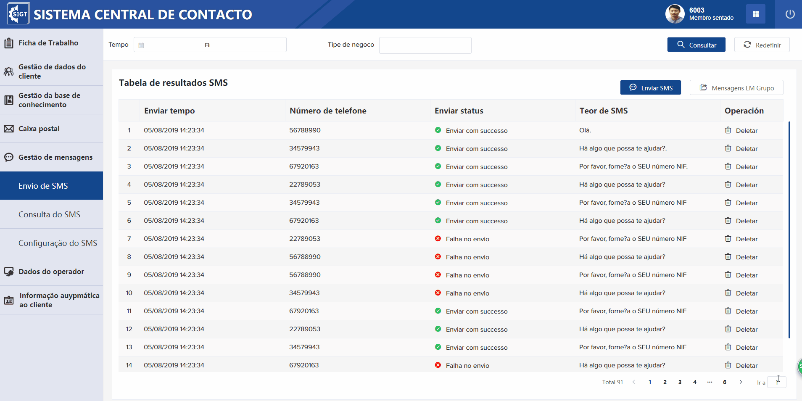

基础种子工程
===

- [1. 题目要求](#1-题目要求)
- [2. 如何开始](#2-如何开始)
- [3. 基本工作](#3-基本工作)
  - [3.1. 页面的实现程度](#31-页面的实现程度)
  - [3.2. 目录结构重构-只列出重点](#32-目录结构重构-只列出重点)
  - [3.3. store改造最佳实践](#33-store改造最佳实践)
- [4. 提高工作](#4-提高工作)
  - [4.1. 响应式布局最佳实践](#41-响应式布局最佳实践)
  - [4.2. 主题切换最佳实践](#42-主题切换最佳实践)
  - [4.3. 动画库animate.css应用](#43-动画库animate.css应用)
- [5. 发布网站](#5-发布网站)
  - [5.1. 打包大小分析](#51-打包大小分析)
  - [5.2. 切换打包环境](#52-切换打包环境)


# 1. 题目要求

+ 高保真还原界面

# 2. 如何开始

项目根目录下，`cmd`运行：

```shell
npm install
npm run serve
```
> 运行成功后，浏览器输入指定地址（默认[http://localhost:8080/](http://localhost:8080/)），进入登录页面

# 3. 基本工作

## 3.1. 页面的实现程度

+ 高保真还原界面，包括布局，组件大小，颜色，字体等；
+ 点击退出，有登录界面，可以登录；
+ 搜索，分页，刷新，删除，均模拟真实数据和业务实现；
+ 菜单数据读取配置文件，不是写死，业务model完善，少用any；

## 3.2. 目录结构重构-只列出重点

- main.ts 改造

之前

```
src
└─main.ts

```

现在

```
// 重构说明
// 之前main.ts非常冗余,什么代码都堆叠在这里，现在通过拆分，结构变清晰

src
├─main.ts
└─utils
   └─app-init.ts
```


+ gulpfile.js 改造

之前

```
violet-seed
└─gulpfile.js

```

现在
```
// 重构说明
// 之前gulpfile.js非常冗余，结构不清楚，通过拆分，结构变清晰

violet-seed
├─gulpfile.js
└─scripts
   ├─gulp-clean-cache.js
   ├─gulp-merge-i18n.js
   ├─gulp-publish.js
   ├─gulp-publish-source.js
   ├─organization.ts
   └─gulp-skins.js
```


- router 改造

之前

```
src
└─router
   └─index.ts

```

现在

```
// 重构说明
// 1、路由模块化，路由代码更清晰
// 2、路由名称变量控制，router-type.ts是路由相关的变量，便于项目各处统一维护

src
└─router
   ├─modules
   │   ├─business.ts           - 业务路由
   │   └─index.ts              - 基本路由
   ├─router-type.ts            - 路由name，path等配置变量
   └─index.ts
```


+ 模块目录划分，业务目录划分

  

```
// 主要思路是由浅入深，外层代码简介，逻辑清晰
// 复杂业务代码抽取出来

src
├─views
│ 	└─layout                    - 工程主要布局入口
├─components
	├─app-main                  - 工程主界面入口
	├─data-table                - 封装的表格组件
	├─messages                  - 消息业务组件
	├─navbar                    - 工程头部界面入口
	├─search-form               - 封装的搜索组件
	├─sidebar                   - 工程左侧菜单界面入口
├─business                      - 业务代码目录，将复杂的业务代码抽取出来，保持vue界面代码可读性
```


## 3.3. store改造最佳实践

+ 采用动态引入store方式，相比之前store写法，更加符合typescript的风格，代码也比较简介

  1、定义

```typescript
import { VuexModule, Module, Mutation, Action, getModule } from 'vuex-module-decorators';
...
export interface IAppState {
  configs: object;
}

@Module({ dynamic: true, store, name: 'app' })
class App extends VuexModule implements IAppState {
  public configs: any = MySessionStorage.getObject(SessionStorageKeys.configs) || {};

  @Mutation
  private SET_CONFIGS(data: any) {
    this.configs = data;
    MySessionStorage.setObject(SessionStorageKeys.configs, data);
  }

  @Action
  public async setConfigs() {
    const data = await AppService.getConfigs();
    this.SET_CONFIGS(data);
  }
}

export const AppModule = getModule(App);


```


2、使用

```typescript
// 更多使用方法请参考种子工程
import { AppModule } from '@/store/modules/app';

const initTheme = () => {
  Skin.changeTheme(AppModule.themeType);
};
```


# 4. 提高工作

## 4.1. 响应式布局最佳实践


+ 工程实现了手机模式和正常模式的响应式布局，实现响应式布局很多种方法，个人认为以下实现较好，理由如下：

  1、开发保持px单位不变，利用postcss-pxtorem组件编译时候切换响应式单位rem；

  2、resize-mixin.ts统一管理响应式布局，代码不会碎片化，难以读懂；

  3、mobile.scss 是统一的手机全局样式，比如手机模式需要隐藏一些多余的dom

+ 实现方式如下：

  ```typescript
  // 1、安装响应式单位转化组件，开发样式保持px单位不变，编译时候自动转换成响应式单位rem
  npm i postcss-pxtorem --save
  // 2、postcss.config.js配置
  module.exports = {
    plugins: {
      'postcss-pxtorem': {
        rootValue: 16,
        propList: ['*']
      }
    }
  }
  ```

  ```typescript
  // 3、resize-mixin.ts统一管理响应式，切换基础字体大小
  import { Component, Vue } from 'vue-property-decorator';
  import { AppModule } from '@/store/modules/app';
  import { DeviceType } from '@/common/enums/device-type';
  
  /**
   * 监听窗口的宽度，做小屏幕自适应
   */
  @Component
  export default class ResizeMixin extends Vue {
    private WIDTH_MOBILE = 900;
    private WIDTH_PAD = 1200;
    private WIDTH_DESKTOP_1080 = 1080;
  
    created() {
      this.resizeHandler();
    }
  
    beforeMount() {
      window.addEventListener('resize', this.resizeHandler);
    }
  
    beforeDestroy() {
      window.removeEventListener('resize', this.resizeHandler);
    }
  
    private getDeviceType() {
      const htmlDom = document.getElementsByTagName('html')[0];
      const rect = document.body.getBoundingClientRect();
      if (rect.width - 1 < this.WIDTH_MOBILE) {
        htmlDom.style.fontSize = '12px';
        htmlDom.className = 'mobile-themes';
        return DeviceType.mobile;
      }
      if (rect.width - 1 < this.WIDTH_PAD) {
        htmlDom.style.fontSize = '14px';
        htmlDom.className = '';
        return DeviceType.pad;
      }
      if (rect.width - 1 < this.WIDTH_DESKTOP_1080) {
        htmlDom.style.fontSize = '16px';
        htmlDom.className = '';
        return DeviceType.desktop1080;
      }
      htmlDom.className = '';
      htmlDom.style.fontSize = '16px';
      return DeviceType.desktop1080;
    }
  
    private resizeHandler() {
      if (!document.hidden) {
        AppModule.setDeviceType(this.getDeviceType());
      }
    }
  }
  
  ```

  

  

  ```typescript
  // 4、mobile.scss 定义手机全局样式
  ```

  
## 4.2. 主题切换最佳实践



+ 主题切换包括elementui主题（保持公司原有切换模式），和自己编写样式主题（利用sass高级特性切换），对比其他切换 方式，有以下有点：

  1、利用sass的能力，编写切换function，灵活性强；

  2、统一管理主题变量，方便维护；

  3、样式的编写和之前没有区别，在需要切换主题的地方，调用sass方法就行；

```scss
// 1、定义多套主题文件
// 主要参数
$YaHeiBlodFont: Microsoft YaHei Bold, Microsoft YaHei Bold-Blod;

// 不同主题的样式文件
$themes: (
  white: (
    main-color: #13488e,
    menus-bg: #e2e5f0,
    menu-active-bg: #13488e,
    main-container-bg: #f5f5f5,
    main-border: rgb(235, 238, 245),
    login-bgc:#2d3a4b,
    head-btn-bg: #2f5bac,
    head-line: #2953a0,
    color-white: #fff,
    color-black: #000,
    table-row-1: #f5f5f5,
    table-row-2: #fafafa,
    table-head-bg: #f6f6f6
  ),
  black: (
    main-color: black,
    menus-bg: black,
    menu-active-bg: gray,
    main-container-bg: black,
    main-border: rgb(235, 238, 245),
    login-bgc:black,
    head-btn-bg: black,
    head-line: black,
    color-white: black,
    color-black: #000,
    table-row-1: black,
    table-row-2: black,
    table-head-bg: black
  )
)
```


```scss
// 2、handle.scss定义切换sassfunction
@import './variables.scss';

// 主题切换
@mixin themeify {
  @each $theme-name, $theme-map in $themes {
    $theme-map: $theme-map !global;
    [data-theme='#{$theme-name}'] & {
      @content;
    }
  }
}

// 获取map的值
@function themed($key) {
  @return map-get($theme-map, $key);
}

// 动态设置颜色class
// $keys: color,background
// $color main_color
// 返回 color: red,background red
@mixin setColorByKeys($keys, $color) {
  @include themeify {
    @each $key in $keys {
      #{$key}: themed($color) !important;
    }
  }
}

// 动态设置颜色class
// $keys: border
// $args: 1px solid
// $color main_color
// 返回 border: 1px solid red;
@mixin setColorByKeysWithArgs($keys, $args, $color) {
  @include themeify {
    @each $key in $keys {
      #{$key}: #{$args} themed($color) !important;
    }
  }
}

```

```scss
// 3、编写的具体sass调用，例如
    .btn-sms {
      width: 146px;
      color: white;
      @include setColorByKeys('background-color', 'main-color');
    }

```


## 4.3. 动画库animate.css应用


+ 手搓动画，难度，时间，精力都比较多，利用成熟的方案，效率高，而且可能是最佳实践，本工程仅仅在一些细节中添加了简单的动画：

  1、输入文字搜索的时候，搜索按钮会出现强调动画；

  2、切换路由的时候，界面会随机使用进入动画；

  3、工程标题有一个定时的循环的旋转动画，不会看起来死板；

+ 实现方式：

```typescript
// 1、安装动画库
npm i animate.css --save
```


```typescript
// 2、在app-init.ts中引入动画库
import Animate from 'animate.css';

const initElement = () => {
  Vue.use(ElementUI);
  Vue.use(Animate);
};
```


```vue
// 3、使用，例如输入搜索时，按钮特效
// 3.1、html中
 <el-button v-if="deviceType !== 'mobile'" :class="searchingClass" @click="search"><i class="iconfont icon-search"></i>Consultar</el-button>
// 3.2 ts中
  get searchingClass() {
    if (this.searching) {
      return 'btn-sms  animated infinite pulse delay-2s';
    } else {
      return 'btn-sms';
    }
  }

```

# 5. 发布网站

## 5.1. 打包大小分析

不需要安装插件，不需要配置 package.json 文件，不需要安装webpack-bundle-analyzer、 ~~！！去看 vue-cli 的官方文档

运行下npm run build --report  浏览器访问 http://127.0.0.1:8888 或者在dist打开report.html静态文件

## 5.1. 切换打包环境
+ 模式的概念 

  Vue CLI 项目中一个重要的概念。默认情况下，一个 Vue CLI 项目有三个模式：

  1、vue-cli-service serve 对应 **development模式**

  2、vue-cli-service build 和 vue-cli-service test:e2e 对应**production模式**

  3、vue-cli-service test:unit 对应 **test模式**

+ process.env

  process.env 是 Node.js 中的一个环境对象。其中保存着系统的环境的变量信息。可使用 Node.js 命令行工具直接进行查看。

  根目录新建两个文件.env.development  .env.production，在里面可以配置参数

  在代码中可以读取到参数，例如：
  ```
  process.env.NODE_ENV
  
  ```
  参考资料：

  https://juejin.cn/post/6844904069136416781 

  https://cli.vuejs.org/zh/guide/mode-and-env.html#%E6%A8%A1%E5%BC%8F

  https://www.jianshu.com/p/d4ffb5d2e2be

  ## 5.3. 优化包大小

  1、npm run build --report 看分析报告哪个模块比较大

  2、shift + f5 强制刷新界面，在Network下可以看到加载的资源大小，此时可截图记住文件大小

  3、编写按需加载代码，shift + f5，分析界面

  ```typescript
  // 全部引入，有51k大小
  import _ from 'lodash';
  // 按需引入
  import merge from 'lodash/merge';
  ```

  4、npm run build --report 看效果

  